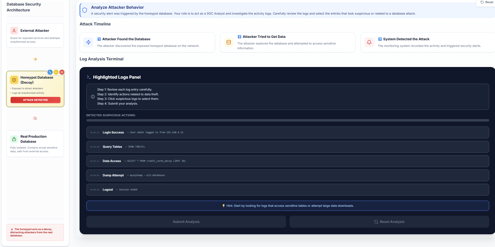
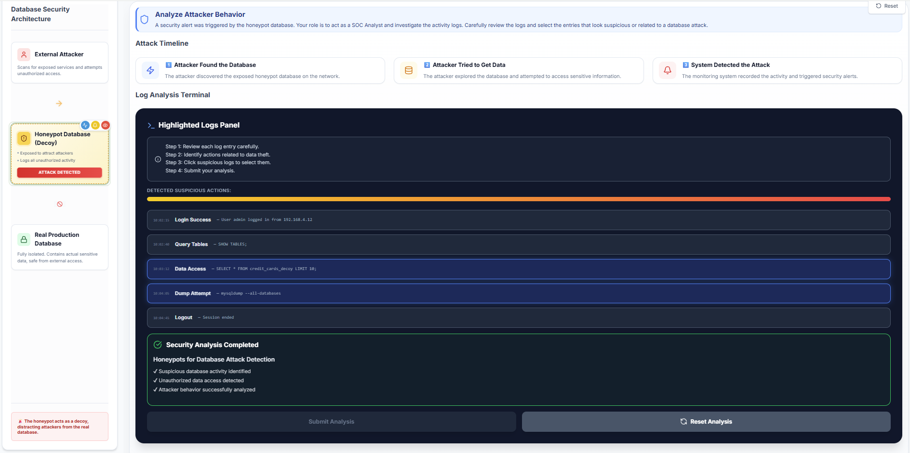

#### Step 1: Introduction to Database Honeypots

- Read the introduction to understand the core concept of a database honeypot.
- Review the **Bank Vault Analogy** to understand how a decoy database protects the real production environment.
- Click **Start Lab** to begin the simulation.

  

#### Step 2: Create Fake Sensitive Tables

- Select one or more **decoy data tables** (e.g., **Users**, **Credit Cards**, **Banking Records**) to serve as simulated sensitive data.
  
  

- Note that deploying multiple decoy tables makes the honeypot appear more realistic to potential attackers.
- Click **Deploy Honeypot** to initialize the decoy database.
  
  

- Click **Next: Monitoring** to proceed.

#### Step 3: Configure Security Monitoring

- Choose the security monitoring tools required to monitor the honeypot:
  - **Query Logging:** Records all executed SQL queries for analysis.
  - **Intrusion Alerts:** Sends immediate notifications upon detecting suspicious activity.
  - **Real-time Monitoring:** Actively flags attacker interactions as they occur.
- Enable the desired options to maximize system protection and monitoring coverage.
  
  

- Click **Start Monitoring** to activate the selected security measures.
- Once a security alert is triggered, click **Proceed to Security Analysis**.

  

#### Step 4: Monitor Attack Interactions

- Observe the **Live Attack Console** as it simulates a real-time external intrusion.
- Monitor the execution of unauthorized queries (e.g., `SHOW TABLES;`, `SELECT`) targeting the decoy database.

  

- Wait for the system to detect the intrusion and trigger a **Security Alert**, then click **View Alert**.

  

- Review the incident summary details, then click **Proceed to Incident Analysis**.

  

#### Step 5: Analyze Attacker Behaviour (Log Analysis)

- Assume the role of a Security Consultant and investigate the attack activity logs.
- Review the attack timeline to understand the sequence from initial discovery to data theft.
- Analyze the log entries generated in the **Highlighted Logs Panel**.
- Identify and select the specific log entries that indicate suspicious data access or database dumping.

  

- Monitor the **Suspicion Meter** as validation for selecting the correct malicious logs.
- Click **Submit Analysis** to verify your investigation. You can click **Restart** to retry the simulation with different configurations.

  