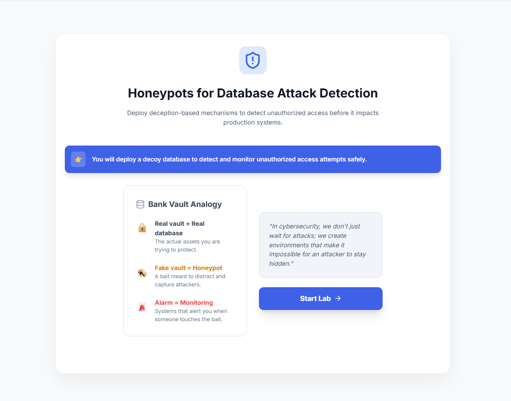
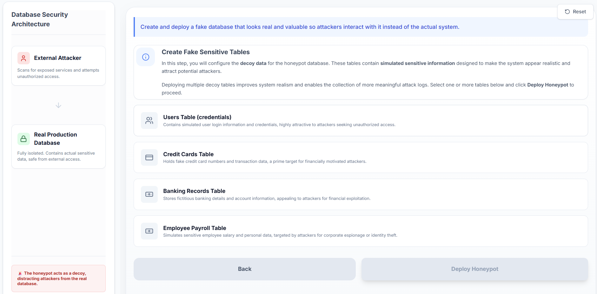
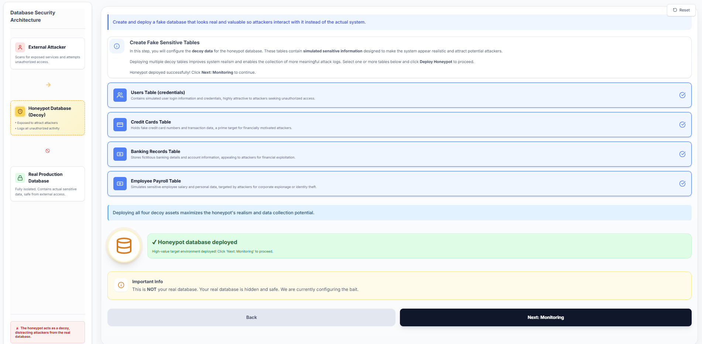
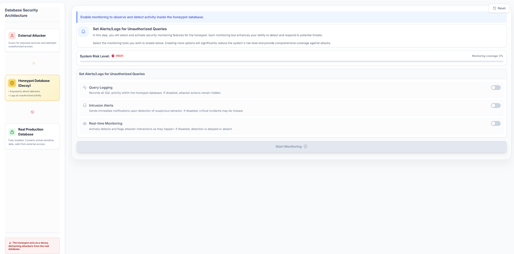
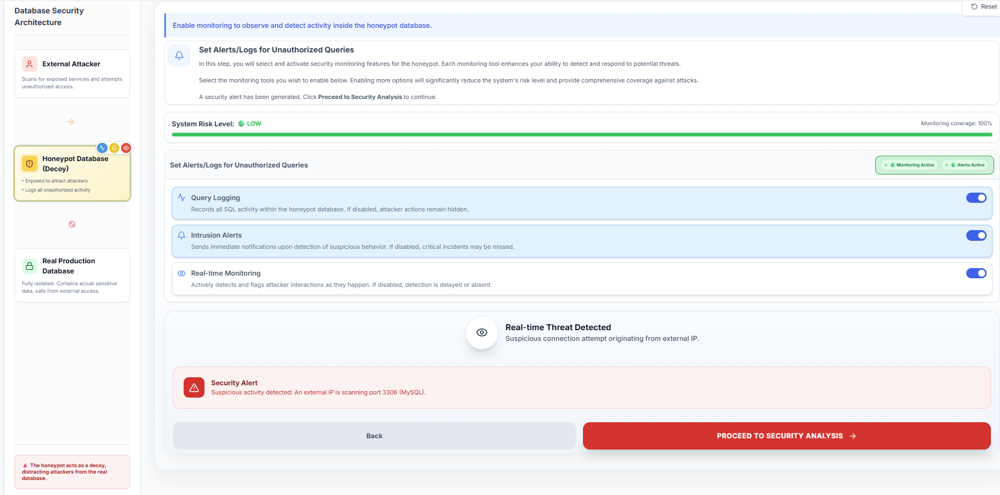
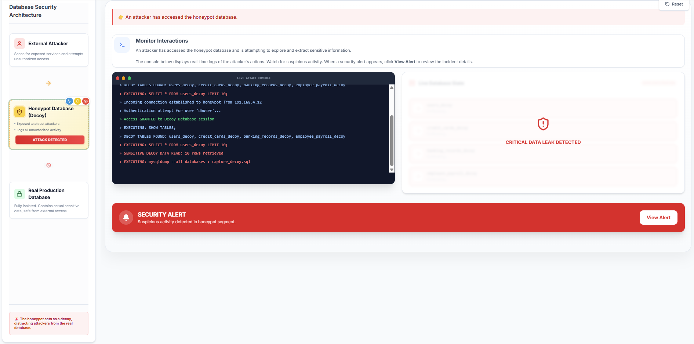
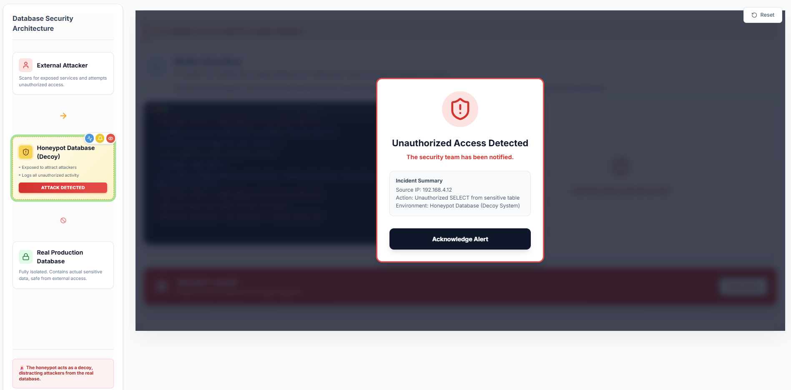
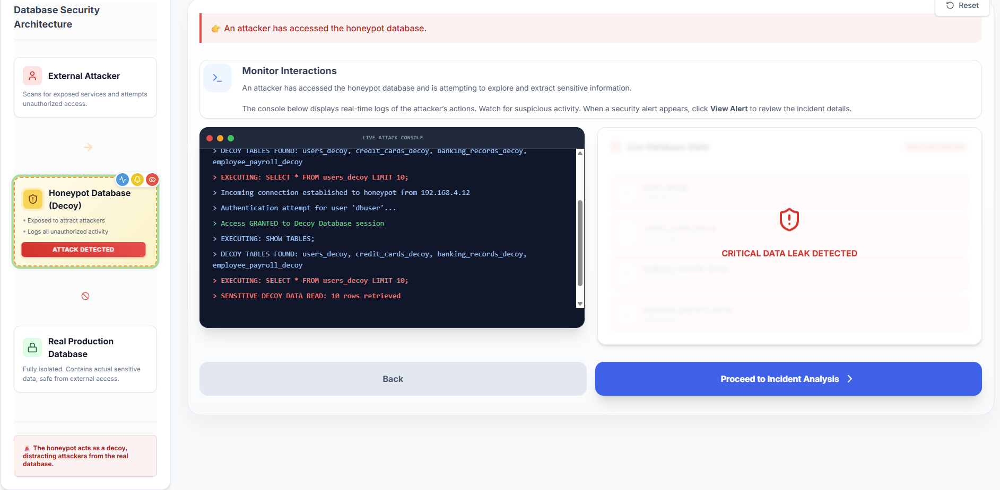
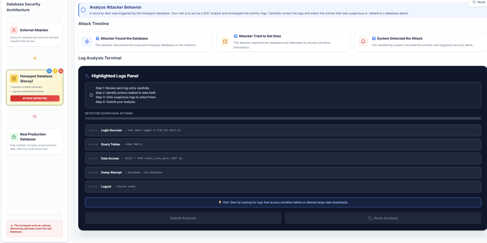
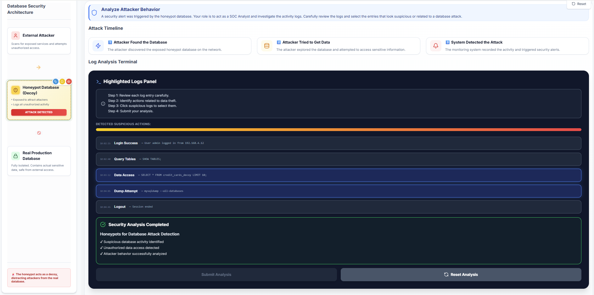

#### Step 1: Introduction to Database Honeypots

- Read the introduction to understand the core concept of a database honeypot.
- Review the **Bank Vault Analogy** to understand how a decoy database helps protect the real production environment.
- Click **Start Lab** to begin the simulation.

#### Step 2: Create Fake Sensitive Tables

- Select one or more **decoy data tables** (e.g., **Users**, **Credit Cards**, **Banking Records**) to simulate sensitive data.

- Deploying multiple decoy tables makes the honeypot appear more realistic to potential attackers.
- Click **Deploy Honeypot** to initialize the decoy database.

- Click **Next: Monitoring** to proceed to the monitoring configuration.

#### Step 3: Configure Security Monitoring

- Choose the security monitoring tools required to observe the honeypot activity:

  - **Query Logging:** Records all executed SQL queries for analysis.
  - **Intrusion Alerts:** Sends immediate notifications when suspicious activity is detected.
  - **Real-time Monitoring:** Actively detects and flags attacker interactions as they occur.

- Enable the desired monitoring options to maximize system visibility and security coverage.

- Click **Start Monitoring** to activate the selected security measures.
- Once a security alert is triggered, click **Proceed to Security Analysis**.

#### Step 4: Monitor Attack Interactions

- Observe the **Live Attack Console** as it simulates a real-time external intrusion attempt.
- Monitor the execution of unauthorized queries (e.g., `SHOW TABLES;`, `SELECT`) targeting the decoy database.

- Wait for the system to detect the intrusion and trigger a **Security Alert**, then click **View Alert**.

- Review the incident summary details and click **Proceed to Incident Analysis**.

#### Step 5: Analyze Attacker Behaviour (Log Analysis)

- Assume the role of a **Security Consultant** and investigate the attack activity logs.
- Review the **attack timeline** to understand the sequence of events from initial discovery to attempted data access.
- Analyze the log entries displayed in the **Highlighted Logs Panel**.
- Identify and select the specific log entries that indicate suspicious data access or database dumping.

- Observe the **Suspicion Meter**, which helps validate the identification of malicious log entries.
- Click **Submit Analysis** to verify your investigation.
- You can click **Restart** to retry the simulation using different configurations.

